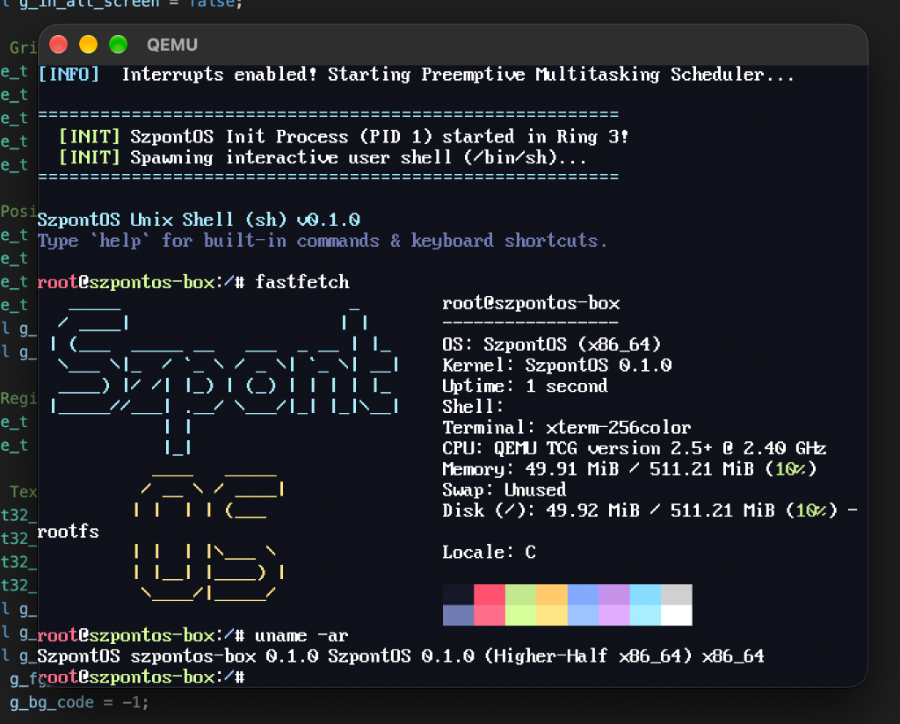

# SzpontOS 🚀
> **SzpontOS** to pierwszy w pełni naszponcony, 64-bitowy system operacyjny pisany od zera zgodnie z myślą techniczną dr. hab. Igora "Makaljera" Grabowskiego, największego Szponciciela, twórcy i pioniera Szpontu.
> Projekt został całkowicie przyszponcony przy użyciu **Szpont Maszyny** Klaudiusz Kodiusz z Modelem Klaudiusz Fable 5.

<p align="center">
  
</p>

<p align="center">
  
  
  
  
  
</p>

<p align="center">
  
</p>

---

## 🌟 Funkcje i Naszponcona Architektura

SzpontOS pozwala korzystać z potęgi nowoczesnego jądra monolitycznego oraz bogatego userlandu w jednym spójnym obrazie:

- 🧠 **Higher-Half Kernel (Ring 0):** Baza jądra pod `0xffffffff80000000`, HHDM (Higher-Half Direct Map) `0xffff800000000000+` z protokołem **Limine v8.x** (BIOS & UEFI).
- ⚡ **Wielozadaniowość i Fast Syscalls:** Wywłaszczający Round-Robin Scheduler, obsługa wątków jądra, procesów Ring 3, mechanizm szybkich wywołań systemowych `SYSCALL`/`SYSRET` (MSR LSTAR/STAR/EFER) oraz `futex` (Fast Userspace Mutex).
- ⏱️ **Zegar i Czas Rzeczywisty:** Sprzętowy sterownik CMOS RTC, timer PIT 1000 Hz (1 ms rozdzielczości) oraz precyzyjna kalibracja taktowania CPU TSC oparta na wzorcach FreeBSD.
- 💾 **Zarządzanie Pamięcią:** 4-poziomowe stronicowanie x86_64 (PML4, PDPT, PD, PT), alokator ramek fizycznych PMM (bitmapa), alokator sterty jądra (Slab/Buddy/Coalescing) oraz dynamiczna sterta userlandu `brk`/`mmap`.
- 📁 **VFS & Systemy Plików:** Modularny Virtual File System z obsługą `Initramfs` (USTAR), `DevFS` (`/dev`), `ProcFS` (`/proc`), `TmpFS` (`/tmp`, `/run`) oraz `Ext2` z buforem blokowym (Buffer Cache).
- 🌐 **Pełny Stack Sieciowy TCP/IP & BSD Sockets:** Sterownik karty sieciowej **Intel E1000 (8254x)**, obsługa Ethernet, ARP, IPv4, ICMP (ping), UDP oraz kompletnej maszyny stanów TCP z Berkeley Sockets API (`socket`, `bind`, `listen`, `connect`, `sendto`, `recvfrom`).
- 🧩 **Dynamiczne Moduły Jądra (.sko):** Ładowanie i relokacja kodu Ring 0 w locie za pomocą narzędzi `insmod`, `lsmod`, `rmmod` i `modinfo`.
- 📚 **Własna biblioteka C (Freestanding Libc):** `libc.so`, `libm.so`, `libdl.a` z pełnym wsparciem wielowątkowości POSIX (`pthreads`), dynamicznego linkowania (ELF interpreter & PLT/GOT) oraz operacji wejścia/wyjścia.
- 🎮 **Aplikacje i Porty:** Natywne binarki userlandu — w tym `sh`, `ls`, `cat`, `top`, `ping`, `ifconfig`, `httpd`, a także przetestowane porty **Zsh**, **GNU nano**, **Fastfetch**, **File/libmagic** oraz dynamiczny **3D Donut**!

---

## 📊 Skala Szpontu

Cały projekt uplasował się na miejscu **"Szpont Kwantowy"** w oficjalnej Skali Szpontu:

<p align="center">
  
</p>

> **Diagnoza:** Poziom naszpocenia jądra osiągnął stan koherencji kwantowej. Wszystkie przerwania, stronicowanie i pakiety sieciowe poruszają się po magistrali z maksymalną prędkością szpontu.

---

## 🚀 Jak Naszponcić i Odpalić (Getting Started)

### Wymagania wstępne

- Kompilator: `x86_64-elf-gcc`, `x86_64-elf-ld`, `x86_64-elf-ar`
- Asembler: `nasm`
- Generator ISO: `xorriso`
- Emulator: `qemu-system-x86_64`

#### Instalacja na macOS:
```bash
./scripts/setup_macos.sh
```

#### Instalacja na Linuxie (Ubuntu / Debian / Arch / Fedora):
```bash
./scripts/setup_linux.sh
```

---

### Budowanie i Uruchamianie

Wszystkie komendy są zarządzane przez główny `Makefile`:

```bash
# 1. Zbuduj kompletny bootowalny obraz ISO
make iso

# 2. Uruchom SzpontOS z akceleracją Virtio-VGA (Zalecane!)
make run-virtio

# 3. Uruchom w klasycznym oknie graficznym QEMU
make run

# 4. Uruchom w trybie headless (konsola szeregowa COM1 w terminalu)
make run-cli

# 5. Uruchom z aktywnym serwerem debugera GDB (port :1234)
make debug
```

---

## 📂 Struktura Katalogów

```
SzpontOS/
├── kernel/                      # Wyższe-Pół (Higher-Half) Jądro Systemu
│   ├── arch/x86_64/             # Inicjalizacja CPU: GDT, IDT, PIC, PIT, ISR, Syscall entry
│   ├── include/                 # Nagłówki wewnętrzne jądra (HAL, FS, MM, NET, SCHED)
│   └── src/                     # Implementacja jądra (sterowniki, VFS, pamięć, sieć, scheduler)
│
├── libc/                        # Freestanding C Standard Library (libc.a, libc.so, libm.so)
│   ├── include/                 # Czyste nagłówki standardu POSIX / C17 / BSD
│   └── src/                     # Implementacja syscalli, stdio, stdlib, string, pthread, sockets
│
├── third_party/                 # Przyszponcone pakiety open-source skompilowane pod SzpontOS
│   ├── zsh/                     # Zaawansowana powłoka Z shell (/bin/zsh)
│   ├── nano/                    # Edytor tekstu GNU nano (/bin/nano)
│   ├── fastfetch/               # Narzędzie informacji o systemie (/bin/fastfetch)
│   ├── file/                    # Identyfikator plików libmagic (/bin/file)
│   └── ncurses/                 # Biblioteka konsolowa TUI (libncurses.a)
│
├── userland/                    # Programy przestrzeni użytkownika
│   ├── init/                    # PID 1 init process
│   ├── sh/                      # Interaktywny shell Unixowy z historią i autouzupełnianiem
│   └── bin/                     # Zestaw narzędzi: donut, ls, top, ping, nc, httpd, ifconfig, ...
│
├── artwork/                     # Oficjalne grafiki i Skala Szpontu
├── scripts/                     # Skrypty budowania initramfs, konfiguracji i uruchamiania QEMU
├── limine.conf                  # Konfiguracja bootloadera Limine
└── Makefile                     # Główny, zunifikowany system kompilacji
```

---

## 💡 Przykładowe komendy w SzpontOS

Po wystartowaniu systemu w powłoce `/bin/sh` możesz wypróbować m.in.:

```bash
# Uruchom obracającego się pączka 3D ze sprzętową akceleracją czasu:
donut

# Zobacz statystyki systemu w stylu Fastfetch:
fastfetch

# Przetestuj obciążenie i procesy w czasie rzeczywistym:
top

# Sprawdź konfigurację interfejsu sieciowego i wyślij ping do bramy:
ifconfig
ping 10.0.2.2

# Załaduj dynamiczny moduł jądra .sko:
insmod /lib/modules/hello.sko
lsmod
```

---

## 💖 Podziękowania

- Serdeczne podziękowania dla **Szpont Maszyny**, która pozwoliła naszponcić cały ten system operacyjny w C i Asemblerze.
- Podziękowania dla twórców projektów **FreeBSD**, **Limine Bootloader** oraz społeczności **OSDev.org** za inspirację architektoniczną i solidne fundamenty szpontu.

## 📜 Licencja

Projekt SzpontOS jest udostępniany na warunkach otwartoźródłowej licencji [MIT](LICENSE).

---

*(C) Copyright by Szpont Industries. All rights reserved.*
